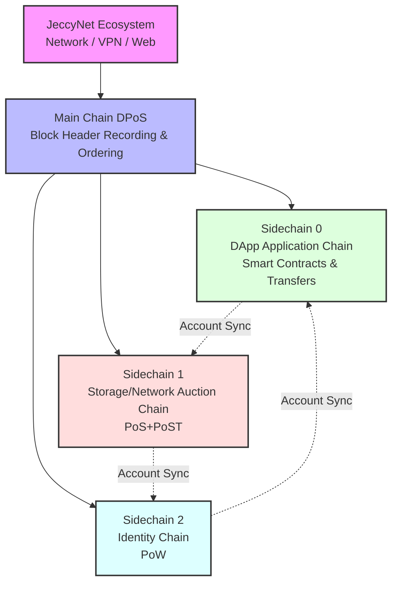

# JeccyChain

JeccyChain is a multi-chain blockchain infrastructure specifically designed for the JeccyNet ecosystem. Its unique architecture consists of one lightweight main chain and three functional sidechains. The main chain is solely responsible for recording sidechain block headers and maintaining the relative ordering between sidechains, while all business functions and value transfers occur on the sidechains. The three sidechains achieve seamless state synchronization through a unified account system, providing foundational support for JeccyNet (decentralized network), JeccyVPN (distributed VPN), and JeccyWeb (ZeroNet-like decentralized website system).

## Architecture Overview

## Chain System Details

### Main Chain - Block Header Coordination Chain

- **Consensus Mechanism**: DPoS (Delegated Proof of Stake)
- **Core Functions**:
  - Record all sidechain block headers to finalize transaction validity
  - Maintain relative ordering between sidechains
  - Handle cross-chain message passing
  - Coordinate sidechain states
- **Features**:
  - Lightweight design
  - No business logic processing
  - Ensure system consistency
  - Prevent double spending

### Sidechain 0 - DApp Application Chain

- **Consensus Mechanism**: DPoS (Delegated Proof of Stake)
- **Main Functions**:
  - Process basic token transfers
  - Support JeccyNet ecosystem DApp deployment
  - Execute smart contracts
  - Support Web3 applications
- **Features**:
  - High throughput
  - Low transaction latency
  - Complete account system
  - Real-time state synchronization

### Sidechain 1 - Storage Auction Chain

- **Consensus Mechanism**: DPoS (Delegated Proof of Stake) + PoST (Proof of Space Time) + PoBT (Proof of Bandwidth Time)
- **Main Functions**:
  - JeccyNet network resource auction
  - JeccyWeb storage service
  - VPN node bandwidth allocation
  - Storage space management
- **Features**:
  - Complete account system
  - Dynamic pricing mechanism
  - Real-time state synchronization
  - Resource allocation optimization

### Sidechain 2 - Identity Chain

- **Consensus Mechanism**: PoW (Proof of Work)
- **Main Functions**:
  - Identity Token issuance
  - Ecosystem identity construction
  - Credit evaluation system
  - Resource access control
- **Features**:
  - Complete account system
  - Real-time state synchronization
  - Decentralized incentives
  - Sybil attack prevention

## Unified Account System

### Account Synchronization Mechanism

- Three sidechains share a unified account system
- Real-time account state synchronization
- Atomic transaction guarantee
- Cross-chain consistency maintenance

### Cross-chain Transactions

- Transfers possible on any sidechain
- Automatic account balance synchronization
- Unified transaction verification
- Atomic guarantee mechanism

## Dual Token Economic System

JeccyChain adopts a dual token design, achieving a more efficient and decentralized ecosystem through the separation of main chain tokens (voting governance) and fuel tokens (resource usage).

### Main Chain Token (JeccyCoin)

- **Issuance Mechanism**:
  - Minted through main chain DPoS consensus
  - Output rate:
    - First year: 10 million tokens
    - Annual halving (years 1-4)
    - Maintains at 625,000 tokens/year after year 5
  - Gas fees automatically distributed among all validator nodes
- **Use Cases**:
  - DPoS validator staking
  - Ecosystem governance voting
  - Validator reward distribution
  - Cross-chain interaction staking
- **Economic Features**:
  - Free trading and transfer
  - Inflation control through halving mechanism
  - Voting weight proportional to holdings
  - Promotes ecosystem decentralized governance

### Fuel Token (Identity Token)

- **Issuance Mechanism**:
  - Generated through PoW mining
  - Higher holdings result in lower block output
  - Completely non-tradeable or transferable
- **Use Cases**:
  - Pay transaction gas fees
  - Pay infrastructure usage fees
  - Network service access threshold
  - JeccyVPN node credit evaluation
  - JeccyWeb site credit verification
- **Balance Mechanism**:
  - Inverse relationship between holdings and mining output
  - Consumed through burning mechanism
  - Non-tradeable nature ensures genuine usage demand
  - Encourages widespread mining participation
- **Decentralization Incentives**:
  - Prevents hash power concentration (harder to mine with more holdings)
  - Promotes fair resource allocation
  - Ensures infrastructure decentralization
  - Reduces monopoly risk

### Dual Token Synergy

- **Clear Division**:
  - Main chain token: Governance and consensus maintenance
  - Fuel token: Resource usage and permission management
- **Complementary Mechanism**:
  - Main chain token: Value flow through trading
  - Fuel token: Real demand through non-transferability
- **Decentralization Guarantee**:
  - Main chain token: Dispersed voting rights
  - Fuel token: Dispersed computing power
- **Ecosystem Balance**:
  - Main chain token: Value measure
  - Fuel token: Usage measure

## Technical Features

- Multi-chain architecture ensures system scalability
- Different consensus mechanisms optimize each chain's specific use
- Innovative identity token mechanism
- Comprehensive cross-chain interoperability
- Flexible resource allocation mechanism

## Application Scenarios

- JeccyNet decentralized network services
- JeccyVPN distributed virtual private network
- JeccyWeb decentralized website hosting
- Cross-platform resource trading market
- Decentralized identity authentication
- Distributed storage services
- Bandwidth trading and allocation
- Cross-chain asset interaction

## Development Status

🚧 Project under active development...

## Contributing Guide

Contributions welcome! Please check our contribution guidelines for details.

## License

[License Information]
