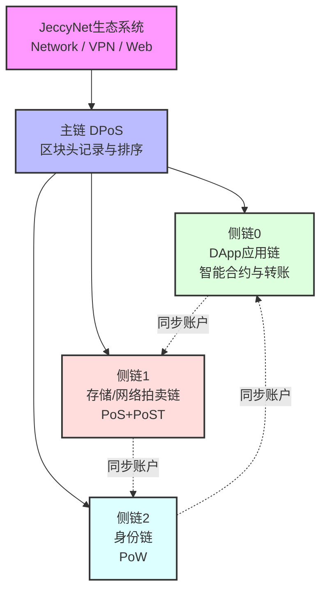

# JeccyChain

JeccyChain是一个专为JeccyNet生态系统设计的多链区块链基础设施。其独特的架构由一条轻量级主链和三条功能性侧链组成。主链仅负责记录侧链区块头和维护侧链之间的相对顺序，而所有业务功能和价值转移都发生在侧链上。三条侧链通过统一的账户系统实现无缝状态同步，为JeccyNet（去中心化网络）、JeccyVPN（分布式VPN）和JeccyWeb（类ZeroNet的去中心化网站系统）提供基础支持。

## 架构概览

## 链系统详情

### 主链 - 区块头协调链

- **共识机制**: DPoS (委托权益证明)
- **核心功能**:
  - 记录所有侧链区块头以确认交易有效性
  - 维护侧链间的相对顺序
  - 处理跨链消息传递
  - 协调侧链状态
- **特点**:
  - 轻量级设计
  - 不处理具体业务
  - 确保系统一致性
  - 防止双重支付

### 侧链0 - DApp应用链

- **共识机制**: DPoS (委托权益证明)
- **核心功能**:
  - 处理基础代币转账
  - 支持JeccyNet生态系统DApp部署
  - 智能合约执行
  - Web3应用支持
- **特点**:
  - 高吞吐量
  - 低交易延迟
  - 完整账户系统
  - 实时状态同步

### 侧链1 - 存储拍卖链

- **共识机制**: DPoS (委托权益证明) + PoST (时空证明) + PoBT (带宽时间证明)
- **核心功能**:
  - JeccyNet网络资源拍卖
  - JeccyWeb存储服务
  - VPN节点带宽分配
  - 存储空间管理
- **特点**:
  - 完整账户系统
  - 动态定价机制
  - 实时状态同步
  - 资源分配优化

### 侧链2 - 身份链

- **共识机制**: PoW (工作量证明)
- **核心功能**:
  - 身份代币发行
  - 生态系统身份构建
  - 信用评估系统
  - 资源访问控制
- **特点**:
  - 完整账户系统
  - 实时状态同步
  - 去中心化激励
  - 防女巫攻击

## 统一账户系统

### 账户同步机制

- 三条侧链共享统一的账户系统
- 账户状态实时同步
- 原子性交易保证
- 跨链一致性维护

### 跨链交易

- 任意侧链都可进行转账
- 账户余额自动同步
- 统一的交易验证
- 原子性保证机制

## 双币经济体系

JeccyChain采用双币设计，通过主链币（投票治理）和燃料币（资源使用）的分离来实现更高效和去中心化的生态系统。

### 主链币（JeccyCoin）

- **发行机制**:
  - 通过主链DPoS共识铸造
  - 产出速率：
    - 第一年：1000万枚
    - 每年减半（1-4年）
    - 第五年后维持在62.5万枚/年
  - 作为燃料费时自动均分给所有验证节点
- **使用场景**:
  - DPoS验证人质押
  - 生态系统治理投票
  - 验证人奖励分配
  - 跨链交互质押
- **经济特点**:
  - 可自由交易和转账
  - 通过减半机制控制通胀
  - 投票权重与持有量成正比
  - 促进生态系统去中心化治理

### 燃料币（Identity Token）

- **发行机制**:
  - 通过PoW挖矿产生
  - 持有量越多，单区块产出量越少
  - 完全不可交易或转移
- **使用场景**:
  - 支付交易Gas费用
  - 支付基础设施使用费
  - 网络服务准入门槛
  - JeccyVPN节点信用评估
  - JeccyWeb站点信用认证
- **平衡机制**:
  - 持有量与挖矿产出呈反比关系
  - 通过燃烧机制消耗
  - 无法交易保证真实使用需求
  - 鼓励全民参与挖矿
- **去中心化激励**:
  - 防止算力集中（持有越多越难挖）
  - 促进资源合理分配
  - 确保基础设施的分散性
  - 降低垄断风险

### 双币协同效应

- **分工明确**：
  - 主链币：治理和共识维护
  - 燃料币：资源使用和权限管理
- **互补机制**：
  - 主链币通过交易实现价值流动
  - 燃料币通过不可转让确保真实需求
- **去中心化保障**：
  - 主链币：投票权分散
  - 燃料币：算力分散
- **生态系统平衡**：
  - 主链币：价值尺度
  - 燃料币：使用度量

## 技术特点

- 多链架构确保系统的可扩展性
- 不同共识机制优化各链特定用途
- 创新的身份币机制
- 完善的跨链互操作性
- 灵活的资源分配机制

## 应用场景

- JeccyNet去中心化网络服务
- JeccyVPN分布式虚拟专用网络
- JeccyWeb去中心化网站托管
- 跨平台资源交易市场
- 去中心化身份认证
- 分布式存储服务
- 带宽交易与分配
- 跨链资产交互

## 开发状态

🚧 项目正在积极开发中...

## 贡献指南

欢迎贡献！请查看我们的贡献指南了解详情。

## 许可证

[License信息]
